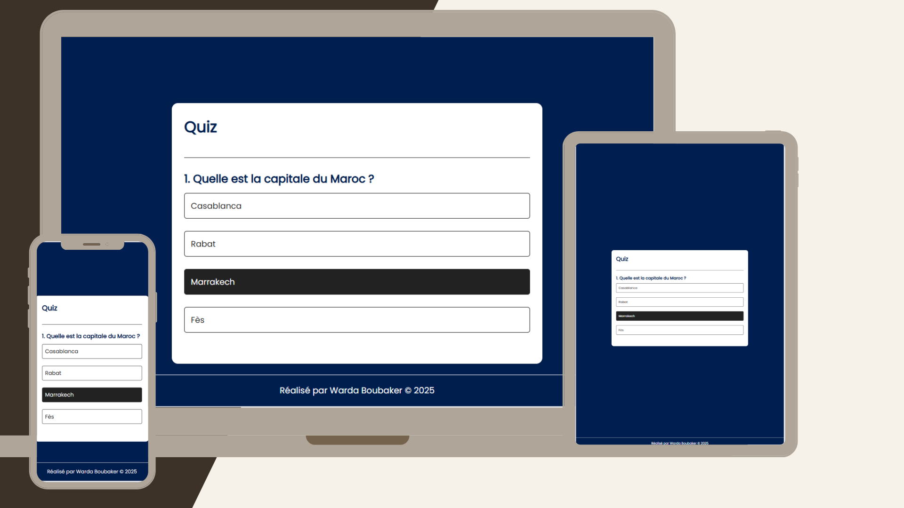

# 🎯 Quiz App

Bienvenue dans **Quiz App** – une application simple et interactive de quiz en HTML, CSS et JavaScript.

## 🚀 Fonctionnalités

- Affichage de questions à choix multiples
- Feedback visuel pour les bonnes et mauvaises réponses
- Bouton "Suivant" pour passer à la question suivante
- Résultat final à la fin du quiz
- Design responsive (mobile, tablette, desktop)

## 🧪 Technologies utilisées

- HTML5
- CSS3
- JavaScript 
- Google Fonts (Poppins)

## 📱 Responsive

L'interface est conçue pour être fluide et agréable sur tous les types d'écrans :

- 📱 Téléphones 
- 💻 Ordinateurs
- 📟 Tablettes

## 📸 Aperçu

## 🧑‍💻 Réalisé par

> Réalisé par **Warda Boubaker**, 2025.  
> Merci d’avoir joué 

## 📂 Structure du projet

